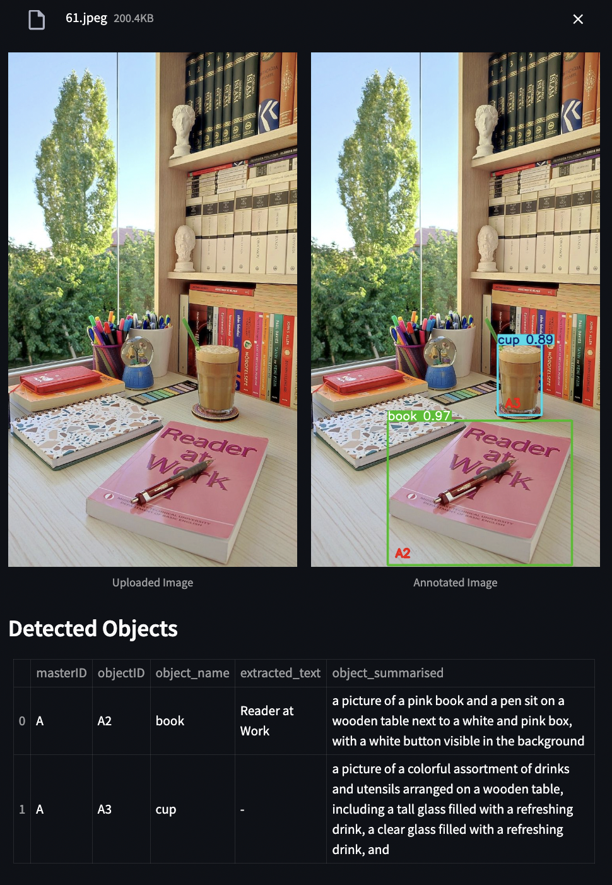
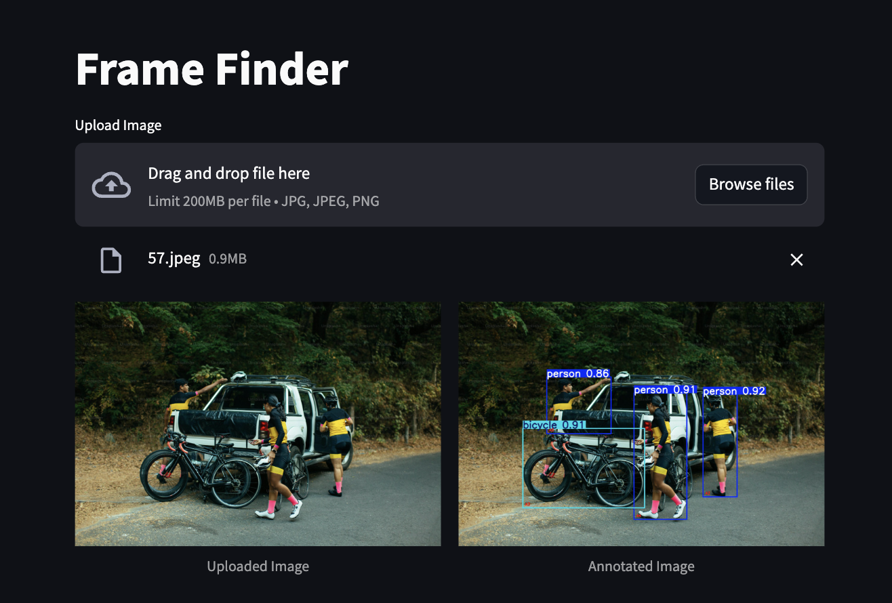

# FrameFinder Pipeline

FrameFinder is a robust and efficient pipeline for image analysis that integrates object detection, text extraction, and object summarization using state-of-the-art machine learning models. This pipeline is designed to streamline the processing of visual data, making it useful for a variety of applications such as automated image annotation, content analysis, and more.

## Table of Contents
- [Introduction](#introduction)
- [Features](#features)
- [Pipeline Details](#pipeline-details)

## Introduction

FrameFinder is a comprehensive pipeline that leverages cutting-edge deep learning models to perform complex image analysis tasks. By integrating advanced techniques in computer vision and natural language processing, This approach is capable of detecting objects, extracting text, and summarizing visual content efficiently and accurately.

## Features

- **Object Detection**: Uses pretrained YOLOv8, to detect and annotate objects within an image.
- **Text Extraction**: Utilizes EasyOCR, built with powerful foundation models, to accurately extract text from detected regions.
- **Object Summarization**: Applies FuseCap, a vision transformer-based model, to generate summaries for each detected object.

## Pipeline Details

1. **Object Detection with YOLOv8**
YOLOv8 (You Only Look Once version 8) is the latest iteration in the YOLO series of object detection models. It is designed for fast and efficient object detection and is known for its real-time performance and accuracy.

- Architecture:
YOLOv8 is built on an enhanced architecture with improvements in the backbone and head modules, making it more efficient in detecting objects.
It leverages CSPNet (Cross Stage Partial Network) to reduce computation cost while preserving accuracy.
The model employs anchor-free design and focuses on direct regression of box parameters and class probabilities.

- Pre-trained Datasets:
YOLOv8 is commonly pre-trained on large-scale datasets like COCO (Common Objects in Context) which consists of over 330,000 images and 80 object categories.
The model is capable of transferring this learning to various specific domains through fine-tuning.

- Number of Parameters:
The number of parameters in YOLOv8 can vary based on the specific model configuration (e.g., YOLOv8-s, YOLOv8-m, YOLOv8-l for small, medium, and large versions), typically ranging from 10 million to over 60 million parameters. For this pipeline, pre-trained yolov8nl is used.

2. **Text Extraction with EasyOCR**
EasyOCR is a lightweight and easy-to-use Optical Character Recognition (OCR) tool that supports multiple languages. It is widely appreciated for its ability to recognize text in images using deep learning models.

- Architecture:
EasyOCR uses a combination of VGG and CRNN (Convolutional Recurrent Neural Network) architectures.
VGG is used for feature extraction from images. It consists of convolutional layers followed by max-pooling layers.
CRNN is employed for sequence modeling. It uses LSTM (Long Short-Term Memory) layers to handle sequential data, making it suitable for text recognition.

- Pre-trained Datasets:
EasyOCR is trained on a variety of datasets including SynthText, ICDAR, and MJSynth, which encompass diverse textual information in various scripts and fonts.

- Number of Parameters:
The model size can vary, typically ranging between 5 to 10 million parameters, depending on the configuration and languages supported.

3. **Object Summarization with FuseCap**
FuseCap is a model that employs vision transformers for generating object summaries. Vision transformers have recently gained attention for their ability to capture complex spatial relationships and patterns in image data.

- Architecture:
FuseCap utilizes vision transformers which operate on a sequence of image patches. This approach allows for global attention mechanisms that are highly effective for understanding and summarizing visual content.
The model consists of transformer encoder layers that process input embeddings and generate contextualized representations suitable for summary generation.

- Pre-trained Datasets:
Vision transformers like FuseCap are often pre-trained on ImageNet, a large-scale dataset with over 14 million images and 1000 classes, providing robust feature extraction capabilities.
Additional fine-tuning is done on domain-specific datasets for specialized tasks.

- Number of Parameters:
Vision transformers generally have a large number of parameters, often exceeding 100 million, depending on the depth and size of the model (e.g., ViT-B, ViT-L).

